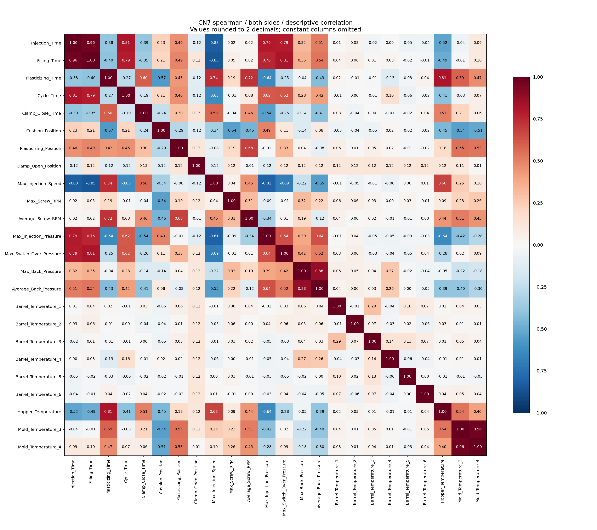
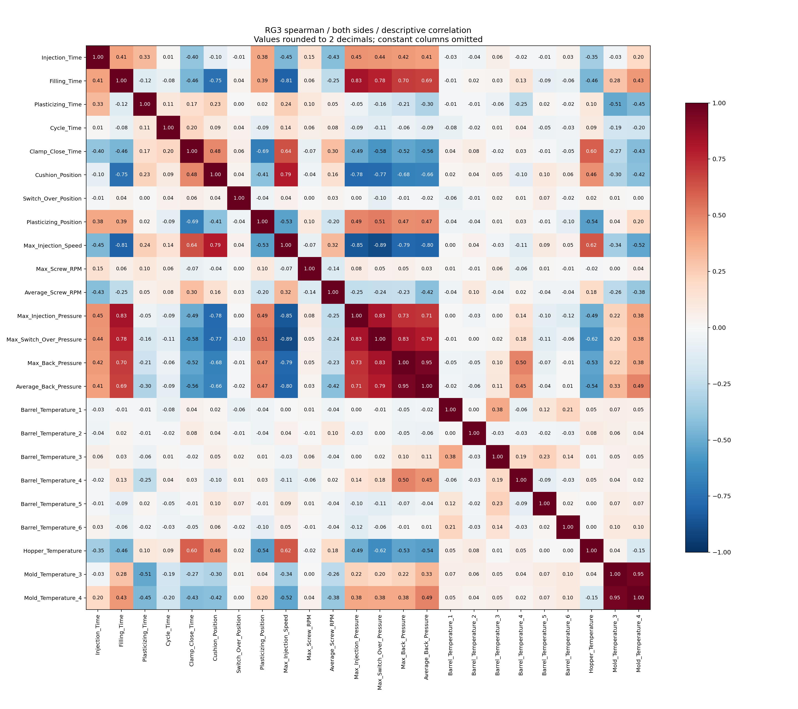

# labeled_data의 상관계수·부품 종류·좌우 기록 분석

2026-09-30. [노트북](../../notebooks/02_labeled_correlations.ipynb), [재현 스크립트](../../scripts/labeled_correlations.py).

## 분석 범위

7,996행에서 동일 ID의 완전 반복을 한 번만 세어 5,232기록을 분석했다. 원본은 변경하지 않았다. 공정 센서 36열의 Pearson(선형 관계), Spearman(순위에 따른 단조 관계)을 계산했다. ID·생산일련번호·시간·설비 코드·검사 사유는 수치 공정 입력으로 넣지 않았다.

- CN7·RG3 각각 및 각 제품의 LH/RH를 분리한 표를 제공한다.
- 모든 제품 합계와 S14 두 제품 합계는 혼합의 영향을 확인하기 위한 참고용이다. 전체 상관계수만 보고 공정 관계를 판단하지 않는다.
- 공정 열끼리의 상관과 공정 열–불량(1) 상관을 별도로 계산했다. 양품 Y=0, 불량 N=1이다.
- 상수 열은 상관을 정의할 수 없으므로 빈 값(NaN)으로 둔다. 0으로 채우지 않는다. 히트맵에서는 상수 열을 제외했다.
- 표본의 시간 의존성과 좌우 쌍 때문에 독립 관측을 가정한 p-value는 제시하지 않는다. 상관은 원인이나 모델 성능이 아니다.

## JX1·SP2는 무엇이며 필요한가

JX1은 제네시스 GV80, SP2는 기아 셀토스의 차종 코드에 대응한다. 사출기 모델명이 아니다. 근거: [제네시스 GV80 공식 구조·구난 문서의 JX1 식별 코드](https://www.genesis.com/content/dam/genesis/gb-en/documents/models/gv80/Rescue_Sheet_Genesis_GV80_EN.pdf), [현대모비스 차종 목록 SELTOS (SP2)](https://www.mobis.com/en/tech/rnd.do). 웹 차종 대응을 제공 파일의 제품명과 연결한 해석이며 특정 생산 로트의 차량 사양을 인증한 것은 아니다.

| 제품명 | 부품명 해석 | 원행 | 고유 기록 | 라벨 | 설비 |
|---|---|---:|---:|---|---|
| JX1 W/S SIDE MLD'G RH | 앞유리 측면 몰딩, 오른쪽 | 2 | 1 | 양품 | S12 / 650톤-우진 |
| SP2 CVR ROOF RACK CTR, RH | 루프랙 중앙 커버, 오른쪽으로 읽힘 | 2 | 1 | 양품 | S01 / 1800TON-우진 |

`W/S`는 windshield, `MLD'G`는 molding, `CVR`는 cover, `CTR`는 center의 약어로 해석한다. SP2의 구체적인 장착 위치·도면은 제공 자료로 확정하지 않는다. 같은 차종 코드라도 루프랙·앞유리·후면 몰딩 등 부품이 다를 수 있으므로 전체 PART_NAME을 함께 봐야 한다.

각각 **한 건을 두 번 반복한 것**이지 서로 다른 두 건이 아니다. 각 제품 안에서 상관을 계산하거나 정상 분포·불량 모델을 학습하기에는 정보가 없다. 다른 설비·부품의 극소수 관측을 CN7·RG3에 섞으면 설비/부품 간 차이를 공정 상관으로 오해할 수 있다.

따라서 **원본에서는 보존하고 현재 S14 CN7·RG3 분석·모델 학습 범위에서 제외**한다. 잘못된 데이터로 판정하거나 삭제한 것은 아니다. 향후 해당 제품을 분석하려면 해당 제품의 충분한 기간·라벨·설비별 자료를 별도로 확보해야 한다.

## 상관계수의 의미와 관측 예

상관계수는 -1~1이다. +1에 가까우면 함께 증가하는 관계, -1에 가까우면 한쪽이 커질 때 다른 쪽은 작아지는 관계, 0 부근이면 해당 상관 방식으로 뚜렷한 관계를 찾기 어렵다는 뜻이다. 0이라고 모든 비선형 관계가 없다는 뜻은 아니다.

제품별 전체 좌우 관측에서 Spearman 상관:

| 제품 | 두 공정 열 | 상관 |
|---|---|---:|
| CN7 | 금형 온도3 ↔ 금형 온도4 | 약 +0.965 |
| CN7 | 사출 시간 ↔ 충전 시간 | 약 +0.963 |
| CN7 | 충전 시간 ↔ 최대 사출 속도 | 약 -0.849 |
| RG3 | 금형 온도3 ↔ 금형 온도4 | 약 +0.953 |
| RG3 | 최대 사출 속도 ↔ 전환 압력 | 약 -0.891 |
| RG3 | 충전 시간 ↔ 최대 사출 압력 | 약 +0.829 |

예를 들어 금형 온도3과 4가 함께 움직인다고 두 센서가 같은 위치이거나 한 센서가 다른 센서 온도를 올린다는 뜻은 아니다. 공통 운전 조건의 영향일 수 있다. 상관이 높은 열을 즉시 삭제하지 않고 정보 중복 후보로만 본다. 트리 모델과 거리/복원 기반 이상 탐지는 중복 열의 영향이 다르므로 이후 동일 검증에서 비교한다.

배압 최대/평균에도 높은 상관이 있지만 해당 열의 단위·집계 구간은 아직 불명확하다. 높은 상관 자체가 센서 정의의 정확성을 보증하지 않는다.





불량과의 관계는 `target_correlations.csv`에 따로 있다. CN7 불량은 28개, RG3는 32개뿐이며 날짜별로 몰려 있다. 불량과의 Pearson은 이진 라벨을 이용한 점이연 상관에 해당한다. 클래스 비율·희귀 극단값에 민감하고, 단일 열 상관이 약하다고 다변량 예측 가능성이 없다는 뜻은 아니다.

날짜·좌우별 평균을 공정값과 라벨 양쪽에서 빼고 계산한 `pearson_within_day_side`도 제공한다. 이는 일별 조건 차이에 대한 민감도 확인용이며 원인 효과나 독립 평가 지표가 아니다. 해당 구간에서 변화가 없으면 계산할 수 없다. 전체 라벨을 사용한 탐색 결과이므로 이 값을 보고 변수를 고른 실험은 별도 미래 자료로 평가해야 한다.

## LH/RH와 캐비티 수는 구분

LH/RH는 차량의 왼쪽/오른쪽 구분이다. 차량이 앞으로 향하는 방향을 기준으로 하므로 차량을 정면에서 바라보는 사람의 좌우와는 반대다. CN7/JX1의 `W/S SIDE MLD'G` 등 앞유리 측면 몰딩에서는 앞유리 양옆 부품의 구분이다. SP2 항목의 LH/RH라면 루프랙 부품의 좌우이며, 데이터의 모든 RH가 앞유리 부품을 뜻하지 않는다.

캐비티는 **금형 안에서 제품 형상을 만드는 공간**이고, 사출기에 차종별로 영구 고정된 공간이라고 보면 안 된다. 사출기에 어떤 금형을 장착했는지와 그 금형에 몇 개의 캐비티가 있는지를 따로 확인해야 한다. 한 금형에서 여러 부품을 성형하는 family mold는 가능한 구성이다. [사출 제조사 Protolabs의 family/multi-cavity 설명](https://www.protolabs.com/services/injection-molding/family-multi-cavity/).

실제 데이터의 같은 설비·같은 시각 좌우 쌍:

| 제품 | 좌우 한 쌍으로 나타난 시각 | 36개 공정값이 모두 동일한 쌍 | 양불이 서로 다른 쌍 |
|---|---:|---:|---:|
| CN7 | 1,979 | 1,979 | 12 |
| RG3 | 627 | 627 | 32 |

이 관측은 좌우가 동일 생산 이벤트와 관련되어 있다는 근거다. 하지만 **LH 하나 + RH 하나를 같은 금형에서 찍는 2캐비티 구성**을 증명하지는 않는다. 설비 수준 공정 기록을 여러 부품의 검사 결과에 연결한 데이터 구조로도 동일한 형태가 나올 수 있고, 제공 파일이 캐비티별 모든 제품을 담았는지도 미확인이다.

현재 표현은 ‘좌우가 동일 공정 이벤트를 공유하는 것으로 보이며 2캐비티는 가능한 가설’이다. 확정하려면 금형 ID/도면·캐비티 수·캐비티별 LH/RH 대응·샷 번호·샷당 취출 수·MES 연결 규칙이 필요하다. CN7과 RG3를 한 사출기에서 관측했다고 두 제품의 캐비티가 동시에 장착되어 있다고 해석하지 않는다.

## 좌우 중복이 상관계수에도 미치는 영향

부품 단위 분석에는 양쪽 라벨이 필요하므로 좌우를 모두 남겼다. 공정 열끼리의 상관에서는 같은 시각·같은 36공정값을 한 번만 세는 민감도 분석도 수행했다. CN7은 1,995개, RG3는 629개 이벤트-공정 벡터가 남았다. 평균을 내거나 불량 라벨을 합치지는 않았다.

CN7은 부품 가중 Pearson과 이벤트-공정 가중 Pearson 사이 특정 열 쌍의 최대 절대 차이가 약 0.273으로 나타났다(Spearman 약 0.044). RG3는 각각 약 0.011이다. 일부 단독 기록·극단값의 가중치가 달라지는 영향일 수 있다. 따라서 특히 CN7의 단일 Pearson 표만 보고 관계를 확정하지 않는다. `matrices/*_event_process_*.csv`와 좌우별 표를 함께 본다.

## 재현

```bash
conda activate kamp-base
python 1.injection-molding/scripts/labeled_correlations.py --output 1.injection-molding/artifacts/correlation_rerun
```

기존 출력 폴더를 덮어쓰지 않는다. `feature_pairs.csv`는 열 간 관계, `target_correlations.csv`는 불량과의 관계, `paired_event_audit.csv`는 좌우 이벤트, `product_inventory.csv`는 제품별 중복·설비·라벨 수다. `verification.json`은 원본·코드 해시와 분석 한계를 기록한다. 새 모델 학습이나 원본 삭제는 하지 않았다.
