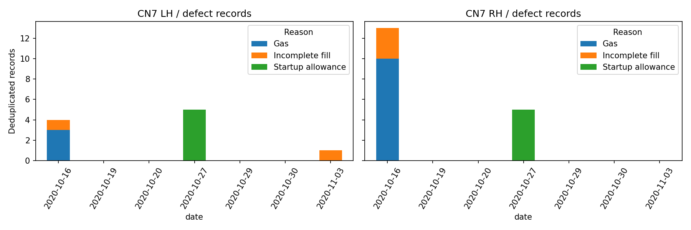
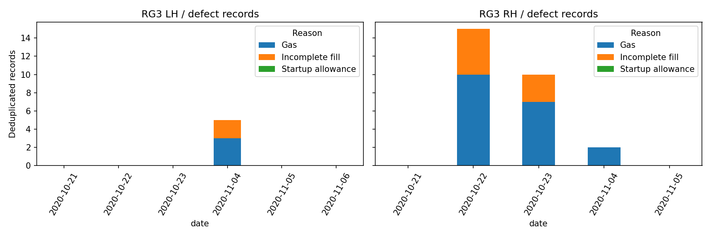
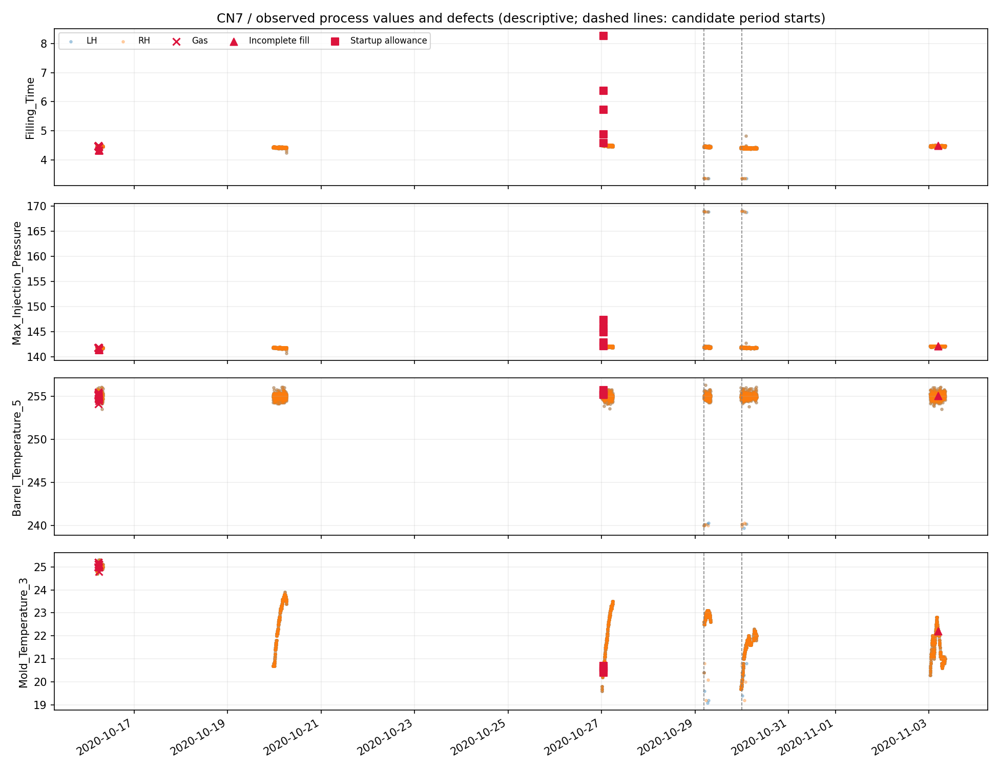
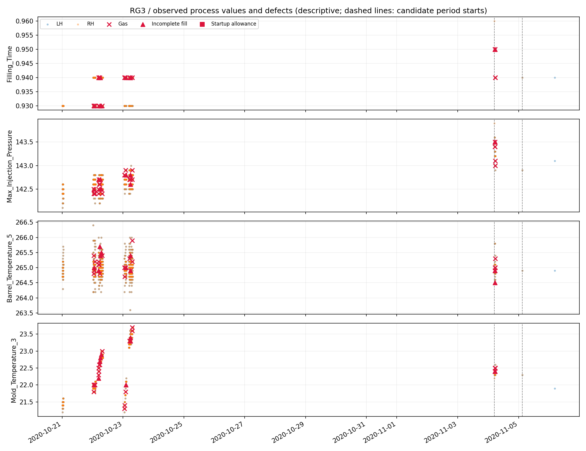

# S14 CN7·RG3 공정·시간 EDA

이번 분석은 모델 성능 평가가 아니라 **어떤 조건에서 불량이 기록됐는지, 독립적인 시간 평가가 가능한지**를 점검한 것이다. 원본 ZIP·기존 실험을 변경하지 않았다. [실행 노트북](../../notebooks/01_process_eda.ipynb)에서 그래프와 표를 확인할 수 있다.

## 1. 분석 범위와 기준

- `labeled_data.csv`의 완전 중복 ID를 한 번만 센 뒤 S14 설비의 CN7 앞유리 사이드 몰딩, RG3 W/SHLD 몰딩의 LH/RH만 선택했다. 같은 ID에 서로 다른 값이 있으면 중단하도록 검사한다.
- CN7 3,974기록·불량 28개, RG3 1,256기록·불량 32개, 총 5,230기록·불량 60개다. 각각의 행이 독립적인 물리 샷이라는 뜻은 아니다.
- 시간순 정렬 후 좌우별로 분석했다. 같은 설비·제품·시각의 좌우는 평가 구간이 갈리지 않게 했다.
- 살펴본 공정 열 10개: 사출·충전·가소화·사이클 시간, 최대 사출 압력·속도, 쿠션 위치, 배럴5·금형3·금형4 온도. 공정 단계별 대표값이며 성능이 잘 나오는 순서로 고른 열이 아니다. RPM·배압 최대/평균은 단위·정의 불확실성이 있어 이번 물리 해석에서 제외했다.
- 결과가 알려진 전체 자료를 보는 **탐색 분석**이다. 아래 시간 분할은 실행 가능성 확인용이며 한 번도 보지 않은 최종 테스트셋을 확보했다는 뜻이 아니다.

## 2. 날짜·좌우·불량 사유

| 제품 | 날짜 | 실제 기록된 불량 |
|---|---|---|
| CN7 | 10/16 | LH 가스 3·미성형 1, RH 가스 10·미성형 3 — 총 17 |
| CN7 | 10/27 | LH/RH 각각 초기허용불량 5 — 총 10 |
| CN7 | 11/03 | LH 미성형 1 |
| RG3 | 10/22 | RH 가스 10·미성형 5 — 총 15 |
| RG3 | 10/23 | RH 가스 7·미성형 3 — 총 10 |
| RG3 | 11/04 | LH 가스 3·미성형 2, RH 가스 2 — 총 7 |

이 표는 **제공된 기록의 관측 결과**다. 기록이 없는 날 공장이 멈췄다거나 불량이 없었다고 판단하지 않는다. 제공 데이터가 공장 전체 생산을 대표하는지도 확인되지 않았다.





## 3. 공정값에서 보이는 차이

같은 제품·같은 좌우·같은 날짜의 양품과 불량을 비교했다. 단순 전체 평균 비교보다 문맥을 좁혔지만, 여전히 시간대·레시피·검사 방식 차이가 남아 있어 **원인 분석이나 예측 성능의 증거가 아니다.** 특히 사유별 표본은 1~10개 수준이다.

### CN7: 초기허용불량의 공정값 변화가 두드러짐

10/27 좌우 각각 양품 309개, 초기허용불량 5개의 중앙값:

| 열 | 같은 날·같은 쪽 양품 | 초기허용불량 | 읽는 법 |
|---|---:|---:|---|
| `Filling_Time` | 4.49초 | 5.72초 | 이 사례에서는 충전 시간이 길었음 |
| `Max_Injection_Pressure` | 약 142.10 | 약 144.90 | 압력 관측값이 높았음. 단위는 가이드 표기상 MPa |
| `Mold_Temperature_3` | 약 22.40℃ | 약 20.60℃ | 금형 온도 채널3 관측값이 낮았음 |

좌우 10기록은 같은 5개 시각에 대응한다. 독립적인 불량 10샷의 반복 증거로 부풀려 해석하지 않는다. ‘충전 5.72초 이상이면 불량’ 같은 분류 규칙을 도출한 것도 아니다.

10/16 미성형은 충전 시간 중앙값이 4.33초로 당일 양품 4.46초보다 **짧았다**. 반면 11/03 LH 미성형 1개는 4.48초로 양품 중앙값 4.47초와 거의 같았다. **불량이 항상 같은 방향의 큰 편차로 나타나는 것은 아니다.** 가스 역시 10/16 RH의 충전 시간 중앙값은 양품과 같았다.

### RG3: 대표 공정값에서 정상·불량이 겹치는 사례

10/22 RH 양품 285개와 미성형 5개는 충전 시간 중앙값이 모두 약 0.93초였다. 최대 사출 압력 중앙값은 양품 약 142.60, 미성형 약 142.50으로 차이가 작았다. 10/23 RH에서도 충전 시간 중앙값은 가스·미성형·양품 모두 약 0.94초였다.

11/04 LH 미성형 2개의 충전 시간과 금형 온도3 중앙값도 양품과 같았다. 이것이 모든 열·다변량 패턴이 같다는 뜻은 아니다. 다만 **단일 열의 극단값을 찾는 방법만으로 모든 RG3 불량을 해결할 수 있다고 기대하기는 어렵다.** 센서에 없는 재료·배기·금형·검사 정보가 영향을 주는지는 추가 확인이 필요하다.

전체 비교는 `same_day_side_comparison.csv`에 있다. `difference_over_normal_iqr`는 당일 양품 중앙 50% 범위에 대한 차이이며 이상 확률이 아니다. 양품이 10개 미만이거나 IQR이 0이면 계산하지 않았다. 정밀도가 낮거나 거의 상수인 열의 아주 작은 IQR은 비율을 크게 만들 수 있어 원단위 차이와 함께 읽는다.





파랑/주황은 좌우 관측값이며 빨간 표시가 불량 사유다. 점선은 아래 탐색용 구간의 시작이다. 멀리 떨어진 관측을 선으로 연결하지 않았다. 그림에서 크게 벗어난 정상도 보이므로, 극단값만 제거하거나 불량으로 자동 지정하지 않는다.

## 4. 관측 공백과 재시작은 구분해야 함

같은 제품·좌우에서 10분 넘게 기록이 비면 새로운 **관측 구간**으로 표시했다. CN7 좌우 합계 22구간, RG3 19구간이다. 5/10/30/60분 기준을 바꾸었을 때 구간 수가 달라지는 것도 `gap_sensitivity.csv`에 남겼다.

- 10분 기준 관측 구간 시작 후 첫 10분에는 CN7 불량이 0개, RG3는 RH 불량 3개가 있었다.
- CN7 초기허용불량은 이 정의의 구간 시작에서 약 28~37분 뒤에 기록되었다.
- 따라서 ‘초기허용불량=파일 구간의 첫 10분’으로 라벨을 만들 수 없다. 관측 공백은 데이터 누락일 수도 있고, 실제 설비 정지·재시작일 수도 있다.
- 현장 시작/정지 로그가 없어 이번에는 **실제 재시작을 확정하거나 생산 시작 후 경과시간 변수를 확정하지 않았다.**

## 5. 미라벨을 많이 넣기 전에 확인한 분포 차이

학습 종료 시각 이전의 미라벨 중 라벨 자료와 같은 설비·제품·시각인 이벤트 후보를 제외했다. 좌우를 따로 검사하면 한쪽이 남을 수 있어 시각 기준으로 양쪽 모두 보호했다.

| 제품 | S14 미라벨 | 라벨 이벤트 중복 후보 제외 | 남은 학습 후보 |
|---|---:|---:|---:|
| CN7 | 35,239 | 1,211 | 34,028 |
| RG3 | 35,941 | 774 | 35,167 |

이 규칙에서는 양쪽 합계 1,985개를 제외한다. 이전 진단의 **같은 부품까지 일치하는 1,984쌍**보다 보수적으로 1개를 더 제외한 것이다. 후보 수는 정상으로 확인된 수가 아니다. 날짜·부품·설비가 같아도 운영 조건이 같지는 않다.

예를 들어 CN7 LH의 후보 미라벨과 라벨 학습 구간은:

| 항목 | 후보 미라벨 | 라벨 학습 구간 |
|---|---:|---:|
| 사이클 시간 중앙값 | 36.60초 | 59.52초 |
| 최대 사출 압력 중앙값 | 80.20 | 141.80 |
| 금형 온도3이 0인 비율 | 약 67.0% | 0% |

같은 설비·같은 부품명만으로 모든 시기를 하나의 정상 분포로 묶기 어렵다는 신호다. 0이 센서 미사용인지 실제 측정값인지도 아직 미확인이다. 여러 달의 미라벨을 그대로 AE에 넣으면 센서 사용/레시피 변화를 학습하거나 경보로 잡을 수 있다. **운전 조건과 센서 가용성을 나눠 보는 작업이 모델 학습보다 먼저다.** 비교 수치는 `distribution_context.csv`, 시기별 양은 `unlabeled_monthly_counts.csv`에 있다.

## 6. 시간 분할 가능성 점검

관측 날짜를 정렬해 앞 60%·다음 20%·뒤 20%로 나누되 정수 경계는 내림하고 각 구간에 최소 하루를 두었다. **행 수가 60:20:20이라는 뜻은 아니다.** 불량 수를 보고 날짜 경계를 고르지 않았다. 하지만 이 EDA에서 전 기간을 보았으므로 최종 독립 테스트로 부르지는 않는다.

| 제품 | 구간 | 관측 기간 | 기록 수 | 불량 수 |
|---|---|---|---:|---:|
| CN7 | 학습 후보 | 10/16–10/27 | 1,839 | 27 |
| CN7 | 검증 후보 | 10/29 | 454 | 0 |
| CN7 | 평가 후보 | 10/30–11/03 | 1,681 | 1 |
| RG3 | 학습 후보 | 10/21–10/23 | 1,182 | 25 |
| RG3 | 검증 후보 | 11/04 | 71 | 7 |
| RG3 | 평가 후보 | 11/05–11/06 | 3 | 0 |

**이 분할을 그대로 최종 성능 평가에 채택하지 않는다.** CN7 검증에 불량이 없으면 불량 Recall/F1 기반으로 임계값을 선택할 수 없다. 평가의 불량 1개는 맞히는지에 따라 Recall이 0% 또는 100%가 되어 매우 불안정하다. RG3 평가 구간 3개 양품으로는 불량 탐지율을 평가할 수 없다. 불량 없는 구간의 Recall은 0점/100점 대신 계산 불가로 표시해야 한다.

현 단계에서는 날짜를 순차적으로 넘기는 **개발용 시간 백테스트**를 설계하고 날짜별 건수를 함께 보고하는 것이 적절하다. 예를 들어 RG3의 10/21–22→10/23, 10/21–23→11/04는 과거로 학습해 이후 관측을 보는 개발 실험이 가능하지만, 이미 살펴본 날짜이므로 독립 최종 평가가 아니다. 반복 실험 후 좋은 날짜만 선택해서 보고하면 안 된다. 전체 계획과 포함/제외 조건을 먼저 고정하고 향후 새 날짜의 라벨로 최종 평가해야 한다.

## 7. 다음 실험의 순서

1. **같은 설비·부품의 운전 조건과 센서 사용 구간 조사:** 특히 미라벨의 0 온도 채널과 사이클·압력 변화가 언제 생기는지 확인한다. 미래 라벨을 보고 정상 학습 기간을 선택하지 않는다.
2. **개발용 시간 백테스트 고정:** 각 학습·보정·평가 기간, 겹치는 이벤트 제외, 불량 없는 구간 처리 방식을 사전에 적는다. 과거 관측으로만 이동 통계를 만들고 공백·제품 변경 경계에서 초기화한다.
3. **단순 정상 기준부터:** 같은 조건의 과거 기준 대비 편차/PCA/Isolation Forest를 먼저 비교하고, 필요하면 정상 중심 AE를 추가한다. 정상 확인 학습과 미라벨 혼합 학습을 별도 실험으로 둔다.
4. **같은 분할의 분류 대조군:** 기존 CatBoost/XGBoost와 같은 입력·같은 시간 분할로 비교한다. 이상 탐지가 더 좋다는 가정부터 하지 않는다.
5. **결과 설명:** 이상 열·원단위 편차·불량 사유별 발견 수·양품 경보량을 함께 본다. 이상 점수를 곧바로 원인이나 불량 확률로 표현하지 않는다.

이번 단계에서는 모델 학습·임계값 최적화·불량 유형 자동 라벨링을 하지 않았다.

## 재현과 검증

```bash
conda activate kamp-base
python 1.injection-molding/scripts/process_eda.py --output 1.injection-molding/artifacts/process_eda_rerun
python -m unittest discover -s 1.injection-molding/tests -v
```

기존 출력 폴더는 덮어쓰지 않는다. `protocol.json`에 입력/코드 SHA-256과 처리 규칙을, `verification.json`에 원본 불변·기간 분리·미라벨 중복 제외 검사를 기록했다. `rows/`의 행별 분석 뷰는 로컬 보관이며 Git 저장에서 제외한다. 최초 자료 검토·기존 실험 보관본은 변경하지 않았다.
